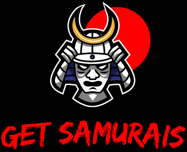

<h1> Readme </h1>

[Link Srge](https://incandescent-neck.surge.sh/)

## Projeto em grupo Samuralab (Labeninjas)

# Sobre

O Samuralab é um site de contratação de serviços, inspirado no GetNinjas.

 
<h1>Autores</h1>
Gabriel Theodoro
<a href="https://www.linkedin.com/in/gabriel-theodoro-ferreira-680b1a18a/">Linkedin</a>
<a href="https://github.com/gabthe">GitHub</a>
 
Julia Moniz
<a href="https://www.linkedin.com/in/j%C3%BAlia-moniz-a912b9172/">Linkedin</a>
<a href="https://github.com/JuliaMoniz27">GitHub</a>
 
João Zang
<a href="https://www.linkedin.com/in/jo%C3%A3o-pedro-zang-gomes-063282163/">Linkedin</a>
<a href="https://github.com/joaozang">GitHub</a>
 
Daniel Andrade
<a href="https://www.linkedin.com/in/daniel-andrade-b91246177/">Linkedin</a>
<a href="https://github.com/DanielAndrade7">GitHub</a>
 
André Luiz
<a href="https://www.linkedin.com/in/andr%C3%A9-luiz-amaral-oliveira-bispo-00a48122a/">Linkedin</a>
<a href="https://github.com/Aluizx6">GitHub</a>
 